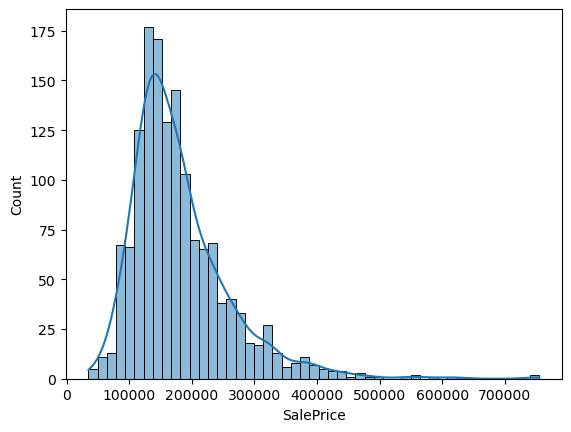
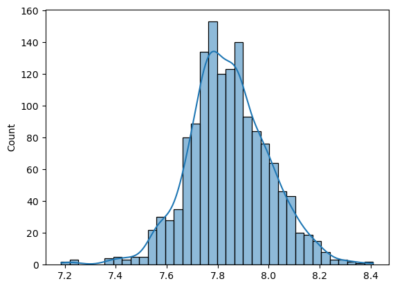
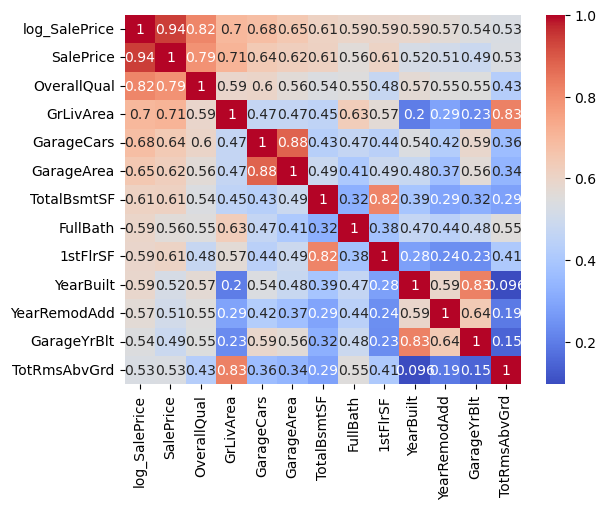
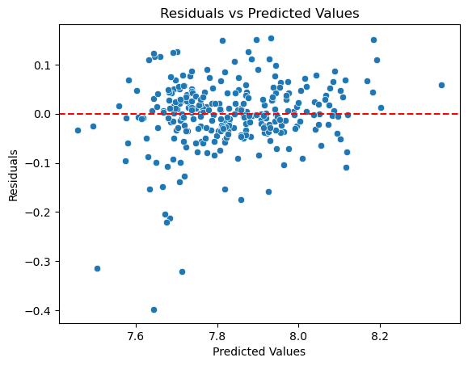

## My First Project as Data Scientist: House Prices Prediction😆

Sebagai proyek pertama saya di bidang ***data science***, saya berfokus pada pengolahan dataset mentah dari kompetisi Kaggle yang sangat populer: [housing prices](https://www.kaggle.com/competitions/home-data-for-ml-course). 

Proyek ini bertujuan untuk membangun model prediktif harga rumah dengan memahami hubungan antara 81 fitur yang tersedia terhadap variabel target (SalePrice/harga jual).

### 🛠️Tech Stack

Saya menggunakan beberapa pustaka Python dalam pengerjaan proyek ini:

- **Data Manipulation**: `Pandas`, `Numpy`
- **Data Visualization**: `Matplotlib`, `Seaborn`
- **Statistics**: `Scipy` (Uji normalitas dan transformasi data)
- **Machine Learning**: `Scikit-learn` (Linear regression, model selection, metrics)

### 📊Hasil Analisis

1. **Distribusi Target**
   Plot distribusi target menunjukkan bahwa distribusinya itu skew ke kanan, mengindikasikan data tidak terdistribusi dengan normal dan tidak memenuhi asumsi linear regresi. Sehingga perlu dilakukan transformasi data. Pada proyek ini, saya menggunakan transformasi data menggunakan metode Box-Cox.

   

   Setelah itu, didapatkan transformasi pangkat dengan $\lambda \approx -0.076$ yang secara signifikan memperbaiki distribusi data pada gambar dibawah

   .
3. **Korelasi Fitur**
   Korelasi fitur ini dilakukan untuk menyeleksi fitur dengan angka korelasi > 0,5 yang selanjutnya fitur ini akan digunakan untuk membangun model

   
4. **Analisis Residual**
   Dari grafik ini menunjukkan bahwa terdapat beberapa prediksi yang melenceng jauh mengindikasikan keberadaan outlier.

   

### 📊Hasil Model

Model yang dibangun menggunakan algoritma regresi linear memberikan performa yang cukup bagus:

- **R-Squared**: 0.838
   Model mampu menjelaskan sekitar 83,8% variasi harga rumah hanya dengan seleksi fitur sederhana

### 🔍 Perbaikan

Meskipun hasil awal sudah cukup baik, terdapat beberapa aspek yang saya perhatikan untuk meningkatkan akurasi model:

- **Multikolinearitas**: Terdapat beberapa fitur independen yang saling berkolerasi kuat pada heatmap. Pengembangan model selanjutnya menggunakan teknik seperti VIF untuk menangani ini
- **Model Non-Linear**: Penggunaan algoritma berbasis pohon seperti Random Forest atau XGBoost berpotensi menangkap pola non-linear, mengingat hubungan antar fitur rumah cukup kompleks
- **Outliers**: Penanganan outliers yang lebih agresif pada tahap pra-pemrosesan akan sangat membantu stabilitas model.
